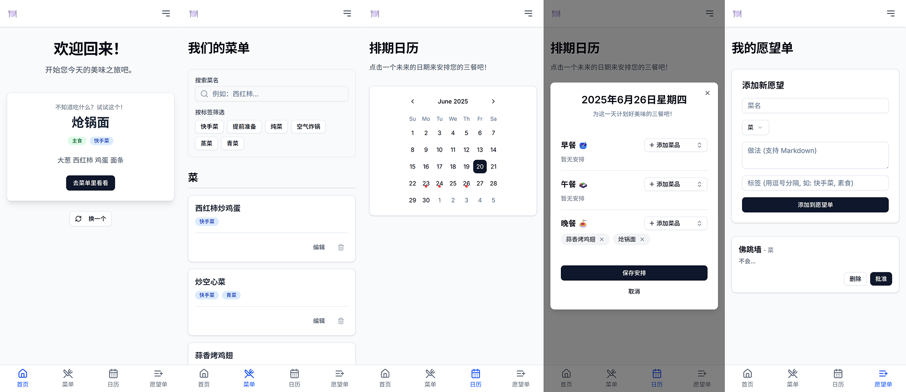

# 🍽️ 菜单规划师 (Menu Planner)

一个现代、简洁且功能强大的家庭菜单规划 Web 应用。旨在解决“今天吃什么？”的终极难题，让菜单管理、购物规划和烹饪变得轻松愉快。



---

## ✨ 主要功能

-   **✅ 菜单管理**: 按“菜”、“汤”、“主食”分类展示所有菜品，支持菜谱的添加、编辑和删除。
-   **✅ 愿望单系统**: 随时记录想吃的菜，一键“批准”即可加入主菜单，实现菜单的动态扩充。
-   **✅ 智能日历排期**: 在交互式日历上为未来14天轻松安排早、午、晚餐，已排期的日期会有清晰标记。
-   **✅ 实时搜索与筛选**: 提供菜名关键字搜索和标签云筛选功能，快速定位想找的菜品。
-   **✅ 菜谱详情展示**: 支持 Markdown 格式的菜谱，点击菜品即可在弹窗中查看格式化的、易于阅读的做法。
-   **✅ 移动端优先**: 采用响应式设计，在移动端使用底部 Tab Bar 导航，确保在手机上拥有最佳操作体验。
-   **✅ 流畅的用户体验**: 为数据加载配备了骨架屏（Skeleton Screens），并实现了平滑的页面切换动画，告别“卡顿感”。

---

## 🛠️ 技术栈

-   **框架**: [Next.js](https://nextjs.org/) (App Router)
-   **语言**: [TypeScript](https://www.typescriptlang.org/)
-   **数据库**: [Vercel KV](https://vercel.com/storage/kv) (基于 Upstash Redis)
-   **UI 组件库**: [Shadcn/UI](https://ui.shadcn.com/)
-   **样式**: [Tailwind CSS v4](https://tailwindcss.com/)
-   **部署**: [Vercel](https://vercel.com/)

---

## 🚀 本地启动

1.  **克隆仓库**
    ```bash
    git clone https://github.com/zzsscc1001/home-menu-planner.git
    cd home-menu-planner
    ```

2.  **安装依赖**
    ```bash
    npm install
    ```

3.  **配置环境变量**
    -   从您的 Vercel 项目仪表盘中，找到连接的 KV 数据库，并下载环境变量文件。
    -   在项目根目录创建一个 `.env.local` 文件。
    -   将下载的环境变量内容复制到 `.env.local` 中。文件内容应如下所示（请使用您自己的值）：

    ```env
    # .env.local
    # Vercel KV & Upstash Redis
    KV_URL="https://..."
    KV_REST_API_URL="https://..."
    KV_REST_API_TOKEN="xxxxxxxx"
    KV_REST_API_READ_ONLY_TOKEN="xxxxxxxx"
    UPSTASH_REDIS_REST_URL="https://..."
    UPSTASH_REDIS_REST_TOKEN="xxxxxxxx"
    ```
    **注意**: `.env.local` 文件已在 `.gitignore` 中，不会被提交到 Git。

4.  **运行开发服务器**
    ```bash
    npm run dev
    ```
    现在，在浏览器中打开 `http://localhost:3000` 即可访问。

---

## 部署

本项目已配置为在 [Vercel](https://vercel.com/) 上进行持续部署。任何推送到 `main` 分支的提交都会自动触发新的构建和部署。

---

## 致谢

本项目在开发过程中，得到了 **Google Gemini 2.5 Pro** 的深度协助。

从最初的需求蓝图梳理、技术选型建议，到具体功能的代码生成、复杂 Bug 的修复，再到贯穿始终的 UI/UX 优化和代码重构，Gemini 提供了覆盖整个开发周期的支持，是本项目能高效、高质量完成的关键伙伴。